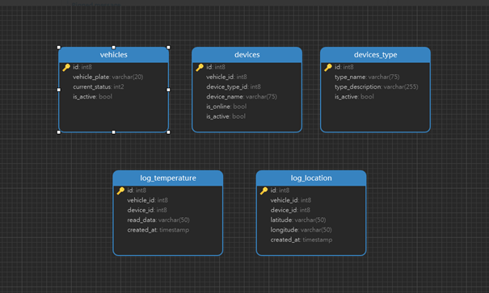
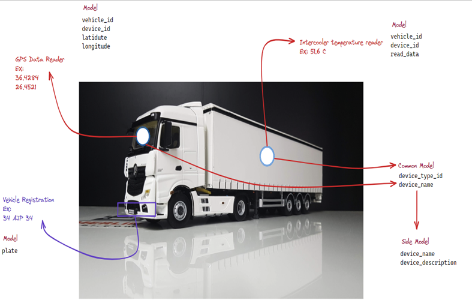

---
### 
1-	Yukaridaki tablolar PostgreSQL ile yazılacak.
2-	NodeJs Express ile basit API yazılacak

Senaryo:
Bir nakliye sirketiniz var, ve 10 adet TIR (uzun araç) var, bu araclarin ustunde 2 adet cihaz (kasa isi kontrol sensoru diğeri ise gps konum bilgisi) var ve bu cihazlari sisteme kaydetmek gerekiyor,
Sisteme kayit yapilirken takip edilecek asamalar
1-	Araclari (TIR) sisteme plakalar ile kaydet
2-	Daha sonra device_type tablosuna 2 adet cihaz turu ekleyeceksiniz (sicaklik sensoru, GPS gibi)
3-	Sisteme kaydedilen her TIR’a 2 adet cihaz tanimlayacaksiniz.
4-	Sonra api ile log_temperature ve log_location route kismina okunan datayi post yöntemi ile gonderiyosunuz.

---
Routes :
Parent root -> vehicle
Get -> vehicle_list
Post-> vehicle_add
Patch-> vehicle_update
Delete-> vehicle_delete

Parent root -> device
Get -> device_list
Post-> device_add
Patch-> device_update
Delete-> device_delete

Parent root -> device_type
Get ->type_list
Post-> type_add
Delete-> device_delete

Parent root -> log_temperature
Get -> temp_list
Post-> temp_add

Parent root -> log_location
Get -> gps_list
Post-> gps_add

---

